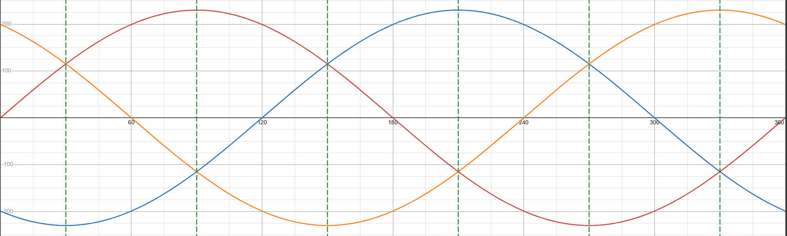
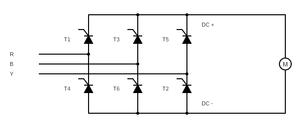

# ⚡ Three-Phase Fully Controlled Thyristor Rectifier

This repository documents the theory, simulation, and practical implementation of a **three-phase fully controlled thyristor rectifier**.  
The aim is to demonstrate how the output DC voltage can be varied by controlling the firing angle of six SCRs (Silicon Controlled Rectifiers).

---

## 🧠 1. Theory

### 1.1 Overview
A three-phase fully controlled rectifier converts three-phase AC to a controllable DC output using six thyristors arranged in a bridge configuration.  
By adjusting the **firing angle (α)**—the delay between the zero-crossing of the supply voltage and the gate trigger pulse—the average DC output voltage can be regulated.
In theory, by keeping the gate signal enabled at all times, the circuit becomes a three-phase diode bridge rectifier albeit with no control of output.  
The output voltage of the circuit is given as:

- $V_{DC} = \frac{3V_{LL}}{\pi} \cos(\alpha)$

where:
- $V_{LL}$  : RMS line-to-line input voltage  
- $\alpha$  : firing angle (0° ≤ α ≤ 180°)

---

### 1.2 Circuit Configuration
The supply to the circuit shall mimic the typical South-African three phase supply - three phases at 50Hz, 120 degrees apart, with an amplitude of 230V.

The electronics circuit looks the same as the three-phase diode bridge rectifier circuit but all of the diodes have been replaced with SCRs (thyristors).

Each phase connects to two thyristors:
- **Upper group:** T1, T3, T5  
- **Lower group:** T4, T6, T2  

At any instant, **one device from the upper group** and **one from the lower group** conduct together for 120°.
The conducting upper group device will be the one with the highest insantaneous voltage and the lower group device will be the one with the lowest instantaneous voltage.

Note from the supply diagram that in a 120 degree window, one phase has the highest insantaneous voltage but the other two phases have different periods of having the lowest insantaneous voltage. 

Commutation occurs every 60° as a result, so conduction pairs change in the following order:

| Interval (°) | Upper SCR | Lower SCR | Conducting Lines |
|---------------|------------|------------|------------------|
| 30–90° | T1 | T6 | R⁺ & B⁻ |
| 90–150° | T1 | T2 | R⁺ & Y⁻ |
| 150–210° | T3 | T2 | B⁺ & Y⁻ |
| 210–270° | T3 | T4 | B⁺ & R⁻ |
| 270–330° | T5 | T4 | Y⁺ & R⁻ |
| 330–390° | T5 | T6 | Y⁺ & B⁻ |

---

### 1.3 Modes of Operation
- **α = 0°** → Acts like a 3-phase diode bridge; delivers maximum positive DC voltage.  
- **0° < α < 90°** → Output voltage decreases as α increases.  
- **α = 90°** → Average DC voltage ≈ 0.  
- **α > 90°** → Operates in **inversion mode**, feeding power back to the AC source (used in regenerative drives).

---

### 1.4 Key Characteristics
| Parameter | Symbol | Description |
|------------|---------|-------------|
| Firing Angle | α | Determines conduction delay |
| Average DC Voltage | Vdc | Controlled by α |
| Ripple Frequency | 6 × f_line | Six pulses per AC cycle |
| Commutation | Natural | Occurs every 60° |
| Control Method | Phase Control | Gate pulses synchronized with supply |

---

## 🧪 2. Future Work

### 🔧 Simulation
- LTspice or MATLAB/Simulink models  
- Firing circuit timing visualization  
- Effect of α variation on DC voltage waveform

### ⚙️ Hardware Implementation
- Build a 3-phase SCR bridge using logic-isolated gate drivers  
- Implement firing control via microcontroller or DSP  
- Capture output voltage and current waveforms with oscilloscope

### 📊 Data & Results
- Compare theoretical and measured output voltages  
- Document commutation behavior and waveform shapes

---

## 📘 References
1. Mohan, Undeland, Robbins — *Power Electronics: Converters, Applications, and Design*  
2. Rashid — *Power Electronics: Circuits, Devices, and Applications*  
3. IEC & IEEE documentation on SCR control techniques  

---

## 🧑‍🔬 Author
**Yasteer Sewpersad**  
Electrical, Control & Instrumentation Engineer  
[GitHub Profile](https://github.com/Yasteer)

---

> *“Control is nothing but intelligent timing.”* – Power Electronics Proverb ⚙️
